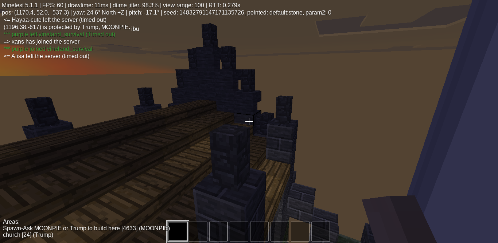
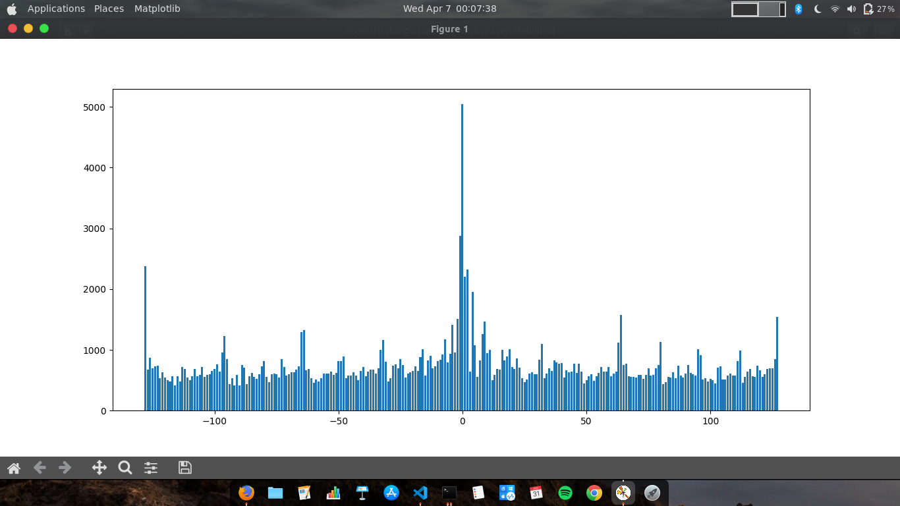

# IntelliSend

## I did faced many internet issues so I created this.
> Currently very beginning. If like please look ahead for contribution. [by raising an issue first]

Some of workings :

> Input : 

> Output : 

Visual Analysis returns : 

TODO : README needs to be improved (but I should not loose photos so attaching it here)
